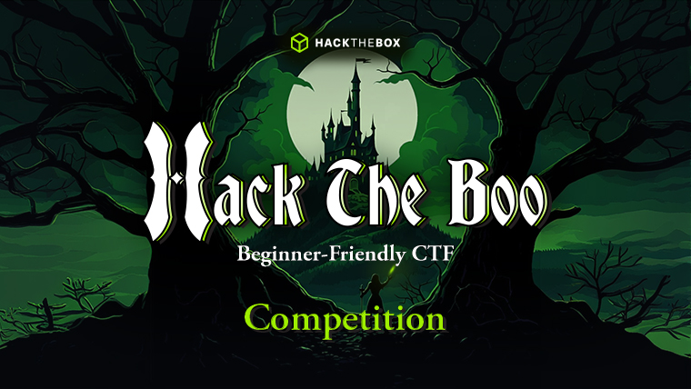

  
  
# HTB CTF - Hack The Boo 2024  
I participated in HackTheBox's Hack The Boo 2024 CTF event, and captured 6/12 flags.  
In this repository are my writeups and any related files for the 6 challenges I completed.  
  
CTF event page link:  
https://ctf.hackthebox.com/event/details/hack-the-boo-2024-competition-1813  
  
# Writeups  
✅ Coding > Replacement  
✅ Coding > MiniMax  
✅ Forensics > Ghostly Persistence  
✅ Forensics > Foggy Intrusion  
✅ Pwn > El Pipo  
✅ Reversing > Terrorfryer  
  
# Stats
**FLAGS**  
6/12  
  
**CHALLENGES**  
6/12  
  
**TEAM RANK**  
672nd  
  
**TEAM POINTS**  
5275pts  
  
# Event Overview  
Enter the spooky world of Hack The Boo, a Capture The Flag competition designed to test your cybersecurity skills while embracing the thrills and chills of the season. 
Perfect for beginners, Hack The Boo combines easy challenges with real-world cybersecurity puzzles. 
The competition kicks off with The Practice, where you can solve beginner-friendly challenges and get familiar with key concepts. 
From Monday, October 21st, to Wednesday, October 23rd, you'll tackle 15 easy challenges with write-ups designed to help you prepare for the real deal. 
Then, from Thursday, October 24th, to Friday, October 25th, come here in The Competition, where the real horrors await—tougher challenges, fierce competition, and the chance to climb the leaderboard for exciting prizes. 
Are you brave enough to face the terror?  
  
**EVENT TYPE**  
Public  
  
**FORMAT**  
Jeopardy  
  
**LOCATION**  
Online  
  
**PLAYERS**  
6349 players joined  
  
**TEAMS**  
6348 teams joined  
  
**CHALLENGES**  
12 challenges across 6 categories  
  
**MAX TEAM SIZE**  
1 Member  
  
