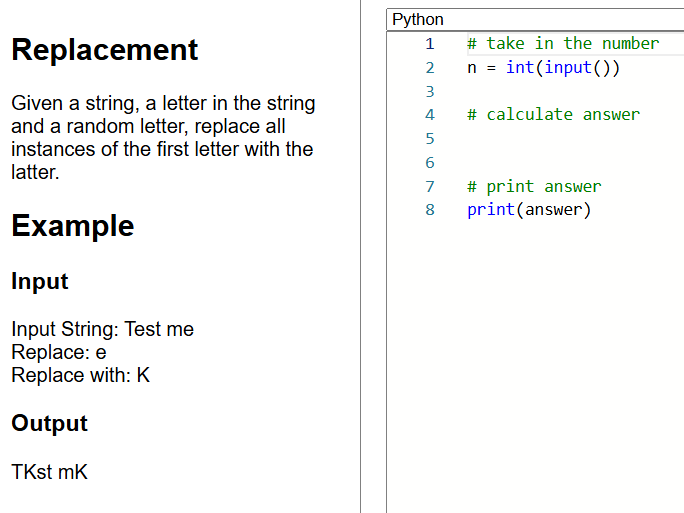
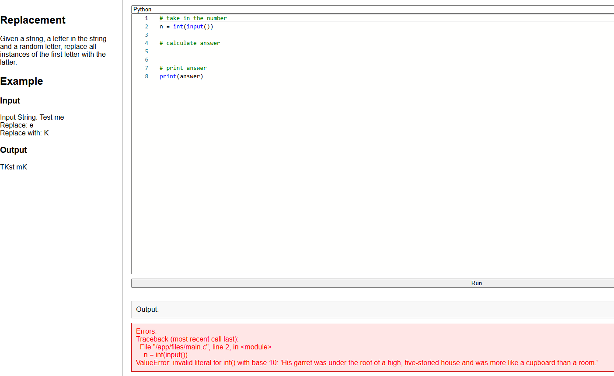
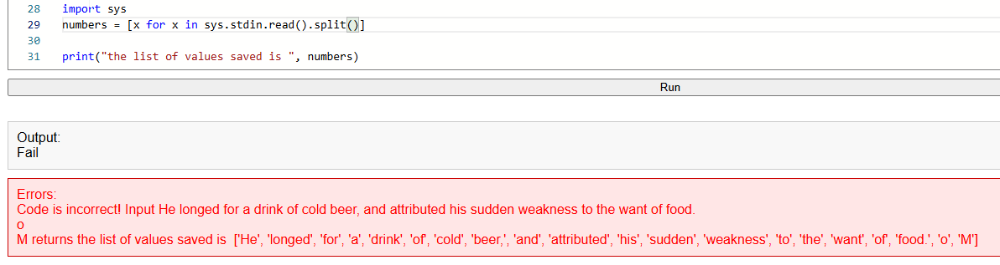
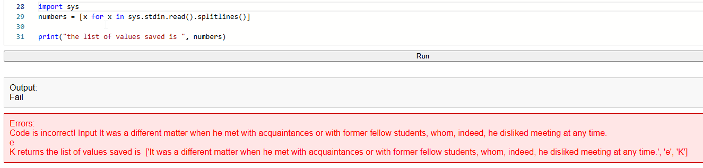

  

## **Challenge Name & Description**  
Replacement  
A cursed spell has altered a scroll, changing key letters. Replace the haunted letter with a random one to break the curse!  
825pts  

## **Instructions/ Clues Provided**  
Given a string, a letter in the string and a random letter, replace all instances of the first letter with the latter.  
### **Example**  
**Input**  
Input String: Test me  
Replace: e  
Replace with: K  
**Output**  
Tkst mK  
  
## **TL;DR Solution**  
```python
# import modules
import sys

# read input and save into a variable, splitting the values by linebreaks
numbers = [x for x in sys.stdin.read().splitlines()]

# take the first value (a string) and replace any occurence of value2 with value3
new_string = numbers[0].replace(numbers[1], numbers[2])

# print the new output
print(new_string)
```
  
## **Process**  
We are provided an ip address and port.  
I enter the details into a brower, and am directed to a webpage:  
  
 
  
There is some placeholder code. I run it and see what appears:  
  
  
Looks like there is a line of text randomly generated each time the code runs.  
  
After some code testing, I realised the input provided is not just the string, but the target letter to be replaced plus the letter used as replacement are also provided, and are also generated randomly each time.  
This is actually written in the instructions, but I didn't understand until this point...  
Ok so there are a total of 3 inputs to save.  
These 3 values are separated by line breaks, so I searched how to save input that has multiple lines.  
  
A solution was to use this:  
```python
import sys
numbers = [int(x) for x in sys.stdin.read().split()]
```
(source: https://stackoverflow.com/questions/44063122/how-to-take-multiple-multiline-input-variables-in-python)  
  
But this code split the string into separate values which I did not want:  
    
  
So I searched again how to split python input, and found 'splitlines()'  
  
  
The input is saved the way I need it now.  
Next step is to replace the letters as instructed.  
I looked up the python function to replace letters and found 'replace()'  
So I add the line:  
```python
new_string = numbers[0].replace(numbers[1], numbers[2])
```
  
As the final step, I just comment out any testing scripts, so only the answer itself is printed:  
  
  
Got the flag! :)  
  
**Flag** `HTB{g0tTa_r3pLacE_th3_sTR1nG!!_fa70f4e32a9130e4a62b1c550ac7d6c4}`  
  
